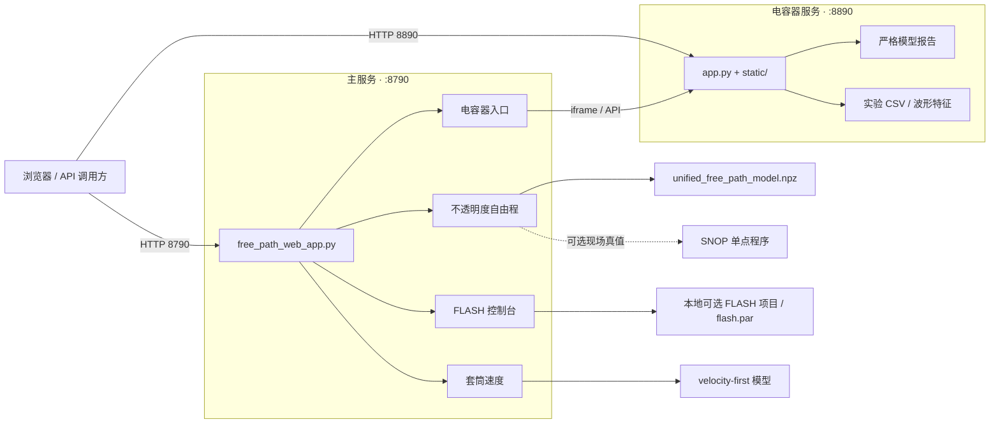
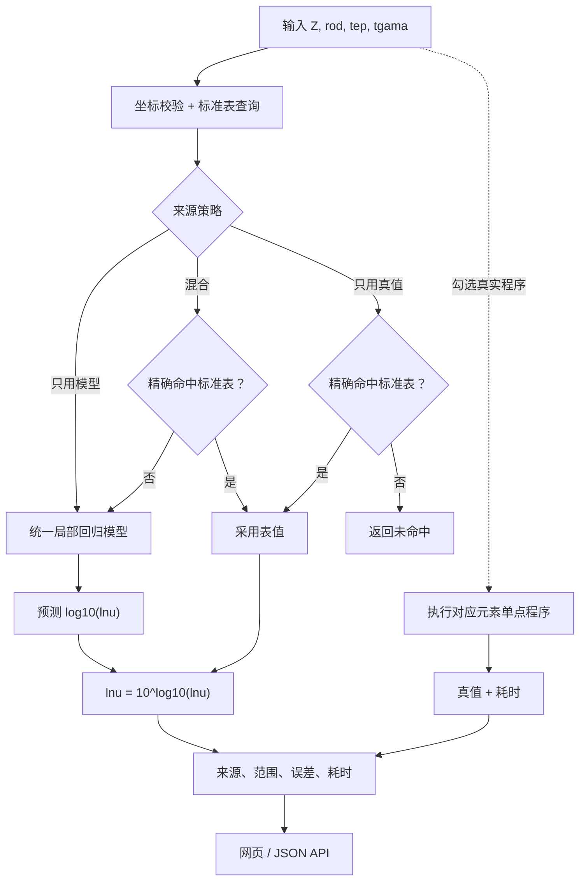

# 自由程 / FLASH / 脉冲电容 / Z-pinch 一体化便携平台

> 一个可整体迁移的科研计算与 AI 推理工作区：GitHub 仓库包含 Web 服务、正式模型、训练与推理代码、训练数据、测试资产、脉冲电容器评估和 Z-pinch；本地便携目录可另外保留授权获得的 FLASH4.8。


最后验证：**2026-08-11 · Linux x86-64 · Python 3.13.12**

## 先看这两条

> [!WARNING]
> 服务没有公网级认证或 TLS，FLASH 控制台还包含可执行本机命令、修改 `flash.par` 和启动任务的能力。只允许在可信本机或受控内网使用，禁止直接暴露到互联网。

> [!CAUTION]
> `FLASH4.8/docs/license_agreement.txt` 是独立的受限许可证，其第 3 条禁止个人用户在 Flash Center 外重新分发 FLASH Code 或组件。因此 `FLASH4.8/` 已加入根级 `.gitignore`，不会上传 GitHub；需要者必须自行从 Flash Center 合法取得。本仓库没有声明覆盖全部内容的开源许可证。

## 页面预览

### 不透明度自由程与 FLASH 接入


统一入口提供单点/批量预测、标准数据表命中、模型与真值比较、训练数据导入导出、永久 benchmark，以及 FLASH 自由程来源控制。

### 脉冲电容器状态评估


独立服务展示严格波形特征、建模步数搜索、时间顺序验证、模型对比和寿命区间。当前 606 条严格特征记录中，最佳独立测试模型为量化感知混合模型，测试 NMAE 为 10.68%。

### Z-pinch 套筒速度


当前正式链路直接预测速度 `v_cm_per_s`，再由 `E = v²m / (2×10¹⁶)` 反算动能。负速度表示向内运动，不表示负动能；现有训练范围仅覆盖 `Z=13`。

## 系统架构



### 自由程请求链



## 30 秒启动

### Docker Compose（推荐）

```bash
git lfs install
git lfs pull
docker compose up --build -d
docker compose ps
```

访问：

- 主平台：`http://目标电脑IP:8790/`
- 电容器独立页面：`http://目标电脑IP:8890/`
- 健康检查：`http://目标电脑IP:8790/health`

停止和查看日志：

```bash
docker compose down
docker compose logs -f freepath
docker compose logs -f capacitor
```

Compose 使用 `restart: unless-stopped`。`.dockerignore` 只缩小镜像构建上下文；Compose 运行时会把整个工作区挂载到 `/app`。

### 原生 Linux

```bash
./setup.sh
./start_all.sh
./status.sh
```

停止：

```bash
./stop_all.sh
```

完整研究/训练依赖：

```bash
./setup.sh --full
./setup.sh --full --torch   # 额外安装电容深度学习依赖
```

原生模式验证于 Python 3.13。Python 版本或 NumPy / scikit-learn ABI 不一致时，优先使用 Docker。

## 当前正式模型

| 模块 | 正式入口 | 当前资产与范围 |
|---|---|---|
| 自由程 | `freepath_service/unified_free_path_core.py` | `unified_free_path_model.npz`；训练元素 `Z=4,13,79`；永久 benchmark 30,190 点，整体 SMAPE 约 3.17% |
| Z-pinch | `zpinch/predict_current.py` | velocity-first；2,730 条样本、14 维特征；当前 `Z=13` |
| 脉冲电容 | `pulse_capacitor_online_eval/app.py` | 606 条严格特征记录；按时间划分训练/验证/测试；最佳测试 NMAE 10.68% |
| FLASH 接入 | `cli-anything-flash/` + 本地可选 `FLASH4.8/` | GitHub 仅提供接入工具；FLASH 本体不上传，需从 Flash Center 合法取得，并受平台 ABI 约束 |

高 Z 专用路由当前为 `route_enabled=false`，正式网页请求统一走 `unified_free_path_model.npz`。`archive_zpinch10000/` 是历史研究归档，不替代当前 velocity-first 模型。

## 常用训练与推理

自由程训练参数：

```bash
.venv/bin/python freepath_service/train_unified_free_path_model.py --help
```

Z-pinch 单点推理：

```bash
.venv/bin/python zpinch/predict_current.py \
  --I 50 --tr 300 --liner-r 5 --foam-r 0.6 --m 30 --Z 13
```

Z-pinch 重新优化：

```bash
.venv/bin/python zpinch/optimize_zpinch_velocity_first.py
```

脉冲电容器严格模型重训：

```bash
.venv/bin/python pulse_capacitor_online_eval/tools/train_strict_deep_models.py --help
```

## FLASH 便携环境

GitHub 克隆默认没有 `FLASH4.8/`。只有从 Flash Center 合法取得代码并放到仓库根目录后，才执行本节命令；现有本地便携副本已完成下述链接修复。

预编译 FLASH 文件依赖原机器的 Linux x86-64、MPI、HDF5、HYPRE、Fortran 和 CUDA ABI。换机器后先加载环境并做重建 dry-run：

```bash
source scripts/flash_env.sh
.venv/bin/python scripts/rebuild_flash_project.py improved_MRT --dry-run
```

确认工具链后才执行实际重建：

```bash
.venv/bin/python scripts/rebuild_flash_project.py improved_MRT --jobs 8
```

便携链接审计：

```bash
.venv/bin/python scripts/repair_flash_symlinks.py
```

当前 73,285 个符号链接已全部改为便携包内目标：旧机器链接 0、断链 0、越出包目录 0。这里的检查不等于已在目标机器完成 MPI/CUDA 仿真验证；仓库不会自动启动 FLASH 仿真。

## API 示例

健康检查：

```bash
curl -fsS http://127.0.0.1:8790/health
```

FLASH 接入控制状态：

```bash
curl -fsS http://127.0.0.1:8790/api/flash/control
```

接口失败、未启用元素、范围外数据或未训练材料必须回退原 opacity 表，不能强行外推。

## 完整目录

```text
free_path_service_portable/
├── freepath_service/             # 8790 主服务、自由程训练/推理、正式模型与数据
├── pulse_capacitor_online_eval/  # 8890 服务、实验 CSV、训练工具与报告
├── zpinch/                       # 当前 velocity-first 模型、训练和推理
├── archive_zpinch10000/          # 历史 Z-pinch 研究资产
├── FLASH4.8/                     # 仅本地可选；Git 忽略，不上传 GitHub
├── cli-anything-flash/           # FLASH CLI harness
├── Cuba-4.2.2/                   # Cuba 源码、头文件与静态库
├── scripts/                      # 环境、自检、等待、FLASH 修复/重建工具
├── output/playwright/            # README 实际页面截图
├── Dockerfile / compose.yaml     # 容器运行
├── setup.sh / start_all.sh       # 原生安装与启动
├── stop_all.sh / status.sh       # 停止与状态
├── SHA256SUMS                    # 逐文件完整性校验
└── SYMLINKS.txt                  # 本地 FLASH 链接清单；Git 忽略
```

更细清单见 [PORTABLE_CONTENTS.md](PORTABLE_CONTENTS.md)；本地 FLASH 整理范围见 [FLASH_PORTABLE_EXCLUSIONS.md](FLASH_PORTABLE_EXCLUSIONS.md)。

## 从 GitHub 获取应用工程（不含 FLASH 本体）

大型模型、训练数据和预编译二进制使用 Git LFS。只下载普通 Git 对象会得到 LFS 指针，不是可运行文件：

```bash
git lfs install
git clone https://github.com/NiubilityZXC/free-path-service-portable.git
cd free-path-service-portable
git lfs pull
git lfs ls-files
```

随后执行完整性和离线模型自检：

```bash
sha256sum -c SHA256SUMS --quiet
.venv/bin/python scripts/portable_smoke_test.py
```

GitHub 仓库保持私有；`FLASH4.8/` 明确不上传。专利文件、原始实验数据、第三方源码和模型权重仍应按各自授权使用。

## 排障

### 8790 为什么会停止？

旧服务由手工 `nohup` 启动，没有 systemd 或容器重启策略；主机重启后不会自动恢复。当前原生脚本使用受控 PID，Docker Compose 还提供重启恢复。

### 端口没有监听

```bash
./status.sh
ss -ltnp 'sport = :8790 or sport = :8890'
```

### 模型文件只有百余字节

这是尚未下载的 Git LFS 指针。执行 `git lfs pull`，再运行 `git lfs fsck`。

### FLASH 可执行文件启动失败

该目录只存在于本地授权副本。确认 MPI/HDF5/HYPRE/CUDA ABI；不匹配时按项目 `setup_call` 重编。

## 验证范围

- Shell 与 Python 语法检查通过。
- Docker Compose 配置检查通过。
- 自由程统一模型、禁用高 Z 路由、Z-pinch 正式模型和电容报告的便携 smoke test 通过。
- 逐文件 SHA256 与关键运行资产抽查通过。
- 73,285 个符号链接已验证不依赖包外旧机器路径。
- `8790/health` 返回 `{"ok": true}`，`8890` 返回 HTTP 200。

这些检查不构成物理模型外部验证，也不表示预编译 FLASH 二进制能跨 ABI 直接运行。

## 延伸文档

- [便携运行详细说明](README_便携运行.md)
- [内容清单](PORTABLE_CONTENTS.md)
- [未携带的大型资产](EXCLUDED_LARGE_ARTIFACTS.md)
- FLASH 本体说明：仅见本地授权副本 `FLASH4.8/README.md`
- [FLASH 排除清单](FLASH_PORTABLE_EXCLUSIONS.md)
- FLASH 运行依赖：仅见本地授权副本 `FLASH4.8/PREREQUISITES_PORTABLE.md`
