# 自由程 / FLASH / 脉冲电容 / Z-pinch 一体化便携平台

> 一个可整体迁移的科研计算与 AI 推理工作区：GitHub 仓库包含 Web 服务、正式模型、训练与推理代码、训练数据、测试资产、脉冲电容器评估和 Z-pinch；本地便携目录可另外保留授权获得的 FLASH4.8。


最后验证：**2026-08-20 · Linux x86-64 · Python 3.13.12**

## 先看这两条

> [!WARNING]
> 服务没有公网级认证或 TLS，FLASH 控制台还包含可执行本机命令、修改 `flash.par` 和启动任务的能力。只允许在可信本机或受控内网使用，禁止直接暴露到互联网。

> [!CAUTION]
> `FLASH4.8/docs/license_agreement.txt` 是独立的受限许可证，其第 3 条禁止个人用户在 Flash Center 外重新分发 FLASH Code 或组件。因此 `FLASH4.8/` 已加入根级 `.gitignore`，不会上传 GitHub；需要者必须自行从 Flash Center 合法取得。本仓库没有声明覆盖全部内容的开源许可证。

## 页面预览

### 不透明度自由程与 FLASH 接入

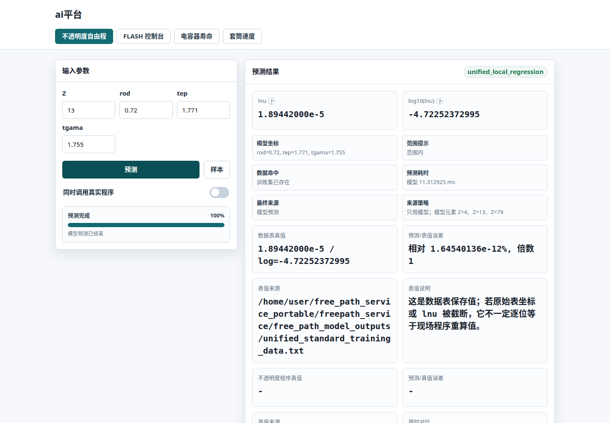

统一入口提供单点/批量预测、标准数据表命中、模型与真值比较、训练数据导入导出、永久 benchmark，以及 FLASH 自由程来源控制。

### 脉冲电容器状态评估

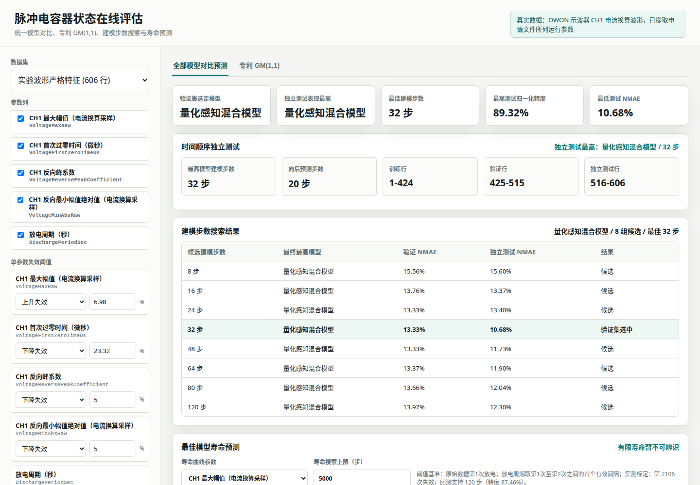

独立服务展示严格波形特征、建模步数搜索、时间顺序验证、模型对比和寿命区间。当前 606 条严格特征记录中，最佳独立测试模型为量化感知混合模型，测试 NMAE 为 10.68%。

### Z-pinch 套筒速度

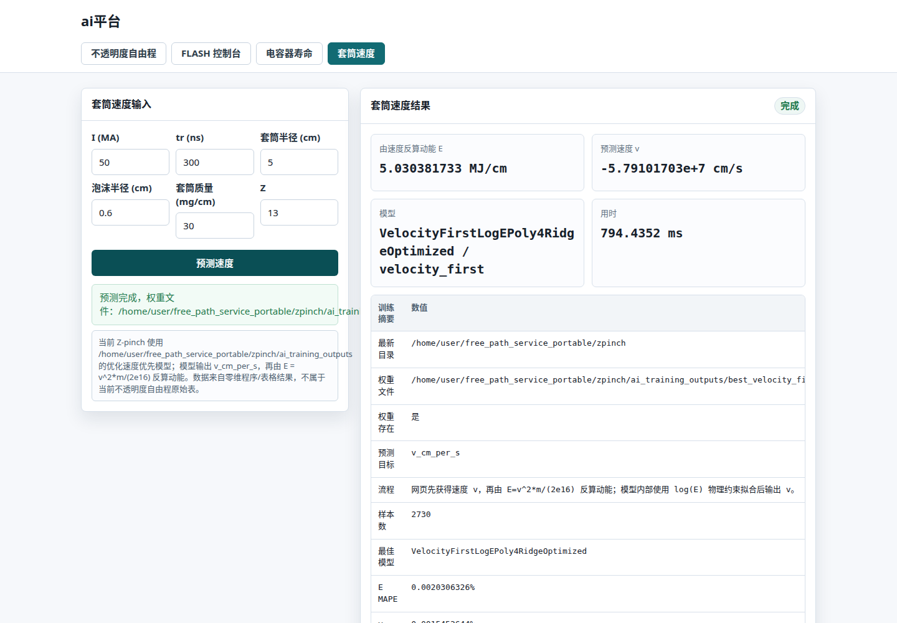

当前正式链路直接预测速度 `v_cm_per_s`，再由 `E = v²m / (2×10¹⁶)` 反算动能。负速度表示向内运动，不表示负动能；现有训练范围仅覆盖 `Z=13`。

## 系统架构

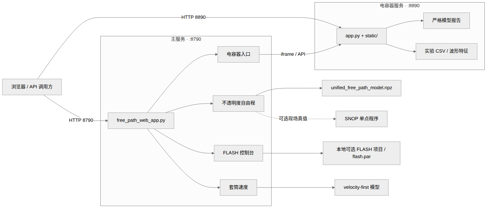

### 自由程请求链

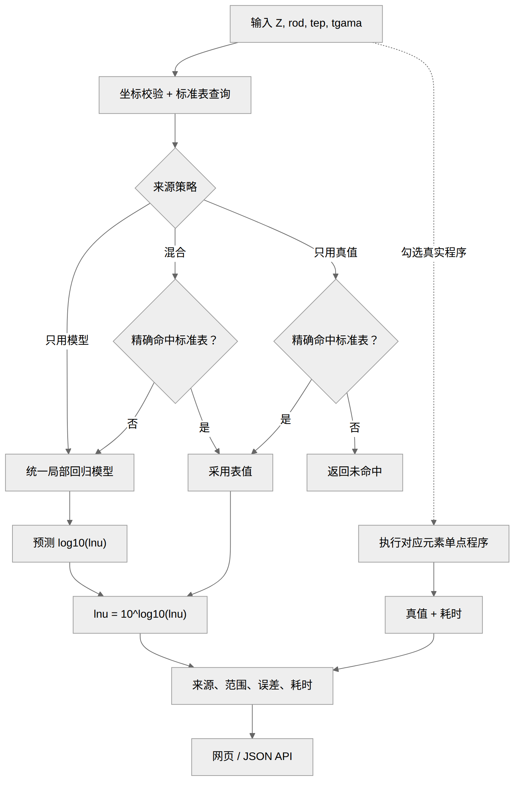

## 30 秒启动

### Docker Compose（推荐）

```bash
git lfs install
git lfs pull
docker compose up --build -d
docker compose ps
```

访问：

- 主平台：`http://目标电脑IP:8790/`
- 电容器独立页面：`http://目标电脑IP:8890/`
- 健康检查：`http://目标电脑IP:8790/health`

停止和查看日志：

```bash
docker compose down
docker compose logs -f freepath
docker compose logs -f capacitor
```

Compose 使用 `restart: unless-stopped`。`.dockerignore` 只缩小镜像构建上下文；Compose 运行时会把整个工作区挂载到 `/app`。

### 原生 Linux

```bash
./setup.sh
./start_all.sh
./status.sh
```

停止：

```bash
./stop_all.sh
```

完整研究/训练依赖：

```bash
./setup.sh --full
./setup.sh --full --torch   # 额外安装电容深度学习依赖
```

原生模式验证于 Python 3.13。Python 版本或 NumPy / scikit-learn ABI 不一致时，优先使用 Docker。

## 模型架构、方法与效果

| 模块 | 正式入口 | 当前资产与范围 |
|---|---|---|
| 自由程 | `freepath_service/unified_free_path_core.py` | `unified_free_path_model.npz`；训练元素 `Z=4,13,79`；active 发布快照随机评测 30,190 点，整体 SMAPE 3.168% |
| Z-pinch | `zpinch/predict_current.py` | velocity-first；2,730 条样本、14 维特征；当前 `Z=13` |
| 脉冲电容 | `pulse_capacitor_online_eval/app.py` | 606 条严格特征记录；按时间划分训练/验证/测试；最佳测试 NMAE 10.68% |
| FLASH 接入 | `cli-anything-flash/` + 本地可选 `FLASH4.8/` | GitHub 仅提供接入工具；FLASH 本体不上传，需从 Flash Center 合法取得，并受平台 ABI 约束 |

高 Z 专用路由当前为 `route_enabled=false`，正式网页请求统一走 `unified_free_path_model.npz`。`archive_zpinch10000/` 是历史研究归档，不替代当前 velocity-first 模型。

> [!IMPORTANT]
> 本节只描述网页当前实际加载的正式资产。所有效果数字来自相应发布快照的冻结 benchmark、内部留出或时间顺序测试，不等同于实验物理精度、跨材料外推精度或 FLASH 全流程验证。历史 CatBoost、高 Z 集成、旧 Z-pinch energy-first 模型仅保留作研究归档，不混入当前正式结果。

### 1. 不透明度自由程：KDTree 局部加权岭多项式

8790 当前只加载 <code>freepath_service/free_path_model_outputs/unified_free_path_model.npz</code>。推理实现是 <code>freepath_service/unified_free_path_core.py</code> 中的 UnifiedModel，Web 入口为 <code>free_path_web_app.py</code>，CLI 为 <code>predict_unified_free_path.py</code>。它不是神经网络，而是在每次查询时用近邻样本拟合一个局部多项式。

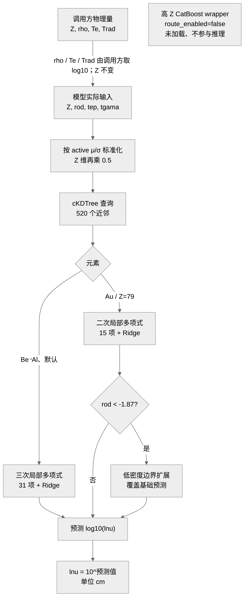

输入与物理量：

| 字段 | 含义 | 模型中的数值 |
|---|---|---|
| <code>Z</code> | 原子序数 | 直接输入；实际训练元素仅 4、13、79 |
| <code>rod</code> | 质量密度 | <code>log10(rho [g/cm³])</code> |
| <code>tep</code> | 电子温度 | <code>log10(Te [eV])</code> |
| <code>tgama</code> | 辐射温度 | <code>log10(Trad [eV])</code> |
| <code>lnu</code> | Rosseland 自由程 | 学习 <code>log10(lnu [cm])</code>，输出时取 10 的幂 |

旧 <code>data.txt</code> 导入器会对前三个物理量取 log10；Be、Al、Au2 标准表中的前三列已经是对数坐标，不能再次取对数。若接入 FLASH，不透明度换算关系为 <code>kappa_R [cm²/g] = 1 / (rho × lnu)</code>。

局部模型先用 <code>x'=(x-mu)/sigma</code> 标准化，并额外把 Z 维乘 0.5。对查询点的 520 个近邻采用 <code>w_i=1/max(d_i,1e-10)^p</code>，在以查询点为原点的差分坐标上解带岭惩罚的加权最小二乘；不惩罚截距，截距就是预测值，奇异时回退到最小二乘。

| 路径 | 多项式 | 基函数数 | Ridge alpha | 距离幂 p | 邻居数 |
|---|---:|---:|---:|---:|---:|
| Be、Al及默认路径 | 3 次 | 31 | <code>1e-3</code> | 1.6 | 520 |
| Au / Z=79 | 2 次 | 15 | <code>3e-3</code> | 1.3 | 520 |

唯一的 active 边界专用逻辑是 <code>Z=79 且 rod&lt;-1.87</code>：每条 (tep,tgama) 曲线取低 rod 端 9 点拟合斜率，以 2,500 个邻居、距离幂 1.5 平滑曲线斜率，查询时由 8 条邻近曲线、距离幂 2.0 插值后线性延伸并覆盖基础预测。其他越界输入仍只是裸局部回归，不存在通用 clamp 或可靠回退。

#### 自由程数据与评测口径

> [!WARNING]
> 线上 active 权重及指标冻结于 **2026-07-02**：训练坐标 297,610 行（Be 89,966、Al 90,041、Au2 117,603），下图 30,190 / 74,975 点是该发布快照的冻结评测。仓库的标准训练表和 permanent benchmark 在 **2026-07-06** 更新成 source-aware 版本：标准表 492,516 行，随机集 39,708 点，连续外推集 96,889 点。后更新文件不是 active 指标表的评测输入；active 权重又已经见过全部 Au2 行，所以不能把新 benchmark 的 Au2 子集称作 active 的独立留出效果。新口径必须按新 key 排除测试点后重训并重新发布权重。

active 发布时标准表快照共 367,603 行：Be 125,000、Al 125,000、Au2 正值 117,603；其中 Au2 原始 125,000 行有 7,397 行因 lnu≤0 被剔除。Be / Al 的冻结随机样本按稳定 SHA256 规则从非边界区域留出，rod 边界样本则留出最低和最高各约 10% 网格层。active NPZ 的 SHA256 为 <code>741ffa62ec7f902fafacfc4c1f84984ebe13ada73024f3da6ea4ce182ab7b1af</code>。

其中 Be / Al 样本是 active 训练划分的真实留出，rod 两端部分属于连续外推留出；Au 的随机 10,197 点和 rod 两端 24,975 点均来自旧 <code>data.txt</code>，是 Au2 训练权重的跨版本冻结 benchmark，不是 Au2 内部留出，也不等同于对 <code>rod&lt;-1.87</code> 专用扩展的盒外验证。

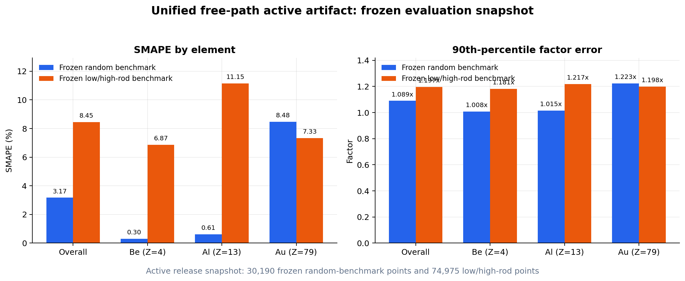

| 冻结集合 | 分组 | n | SMAPE | log10 MAE | P90 因子误差 | P99 因子误差 | 阈值结论 |
|---|---|---:|---:|---:|---:|---:|---|
| 冻结随机 benchmark | 整体 | 30,190 | 3.168203% | 0.01411493 | 1.089375× | 1.495789× | 通过整体阈值 |
| 冻结随机 benchmark | Be / Z4 | 10,034 | 0.304736% | 0.00132346 | 1.007988× | 1.017732× | 通过 |
| 冻结随机 benchmark | Al / Z13 | 9,959 | 0.614475% | 0.00266902 | 1.015237× | 1.062307× | 通过 |
| 冻结随机 benchmark | Au / Z79 | 10,197 | 8.480022% | 0.03788068 | 1.223197× | 1.967947× | SMAPE 略超 8% |
| 冻结 rod 两端 benchmark | 整体 | 74,975 | 8.448567% | 0.03954283 | 1.196852× | 2.785548× | 未通过整体阈值 |
| 冻结 rod 两端 benchmark | Be / Z4 | 25,000 | 6.865713% | 0.02991573 | 1.181325× | 1.443910× | 通过 |
| 冻结 rod 两端 benchmark | Al / Z13 | 25,000 | 11.153327% | 0.05571624 | 1.217250× | 10.449243× | 未通过 |
| 冻结 rod 两端 benchmark | Au / Z79 | 24,975 | 7.325538% | 0.03298996 | 1.197873× | 2.060588× | P99 略超 2.0× |

整体阈值依次为 SMAPE ≤5%、log10 MAE ≤0.025、P90 ≤1.20×、P99 ≤1.80×；单元素阈值依次为 8%、0.040、1.25×、2.00×。因子误差定义为 <code>10^abs(log10_pred-log10_true)</code>。冻结随机 benchmark 和冻结 rod 两端 benchmark 的最大因子误差分别为 47.72× 与 2,803.15×，说明平均指标不能掩盖少数尖峰/深谷。

训练盒约为 <code>rod[-1.87,4.477]</code>、<code>tep[1.771,5.301]</code>、<code>tgama[1.755,4.477]</code>；对应 rho≈1.35e-2–3e4 g/cm³、Te≈59–2e5 eV、Trad≈57–3e4 eV。只对 Be、Al、Au 有直接训练证据。未见 Z 或盒外坐标仍可能返回带 warning 的数值，但不代表经过验证；FLASH 接入应在元素未启用、范围外、接口失败或材料未训练时回退原 IONMIX / opacity 表。

### 2. Z-pinch：log(E) 四阶多项式 Ridge + 物理速度约束

当前 Web 固定加载 <code>zpinch/ai_training_outputs/best_velocity_first_optimized_model_artifact.pkl</code>，正式模型名为 VelocityFirstLogEPoly4RidgeOptimized。训练入口是 <code>zpinch/optimize_zpinch_velocity_first.py</code>，特征与物理包装类在 <code>train_zpinch_surrogate.py</code>，独立推理入口是 <code>predict_current.py</code>。

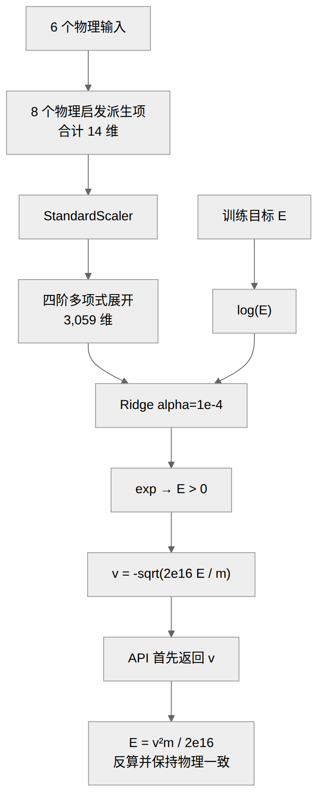

| 类别 | 特征 |
|---|---|
| 6 个基础输入 | <code>I_MA</code>、<code>tr_ns</code>、<code>liner_r_cm</code>、<code>foam_r_cm</code>、<code>m_mg_per_cm</code>、<code>Z_atomic_number</code> |
| 几何派生 | <code>foam_r/liner_r</code>、<code>liner_r-foam_r</code>、<code>π(liner_r²-foam_r²)</code> |
| 驱动派生 | <code>I/tr</code> |
| 交叉项 | <code>I×liner_r</code>、<code>I×foam_r</code>、<code>tr×liner_r</code>、<code>tr×foam_r</code> |

14 维输入经标准化后，<code>PolynomialFeatures(degree=4, include_bias=False)</code> 展开为 3,059 个一次至四次单项式，再由 <code>Ridge(alpha=1e-4)</code> 拟合。外层 TransformedTargetRegressor 学习 <code>log(E_MJ_per_cm)</code> 并用 exp 保证正能量；物理包装层再计算 <code>v=-sqrt(2e16×E/m)</code>。因此 velocity-first 表示 artifact / API 首先返回速度，不是直接对速度做无约束回归；名称中的 optimized 也是固定配置，并未运行网格搜索或贝叶斯优化。

训练表 <code>zpinch/source_data/zpinch_training_data.csv</code> 有 2,730 行，来自零维程序/表格，不是实验测量。每个 (I,tr,liner_r,foam_r) 工况只对应一个优化质量。固定种子 2026 的 splitter 产生 1,910 个 train-index、409 个名为 val 的索引和 411 个 test-index；前两部分未做单独验证，而是立即合并成 2,319 行拟合，最终 artifact 没有用全部 2,730 行重训。另对 7 个随机种子 42、2024、2026、7、13、99、123 重复约 85% / 15% 的内部划分。

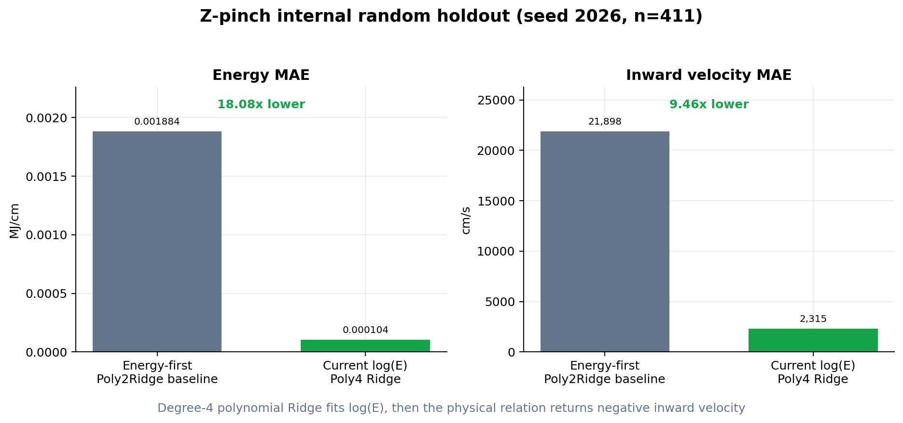

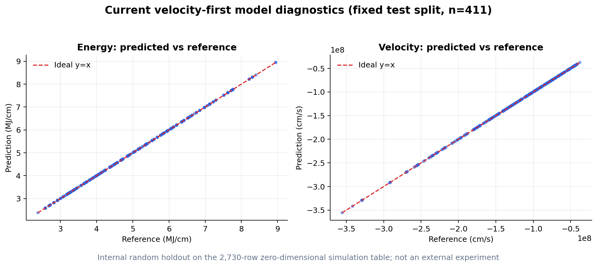

| 评测 | 目标 | MAE | RMSE | MAPE |
|---|---|---:|---:|---:|
| 固定 seed=2026，411 点 | E | 0.0001042203 MJ/cm | 0.0001755668 MJ/cm | 0.00203063% |
| 固定 seed=2026，411 点 | v | 2,314.56 cm/s | 3,954.02 cm/s | 0.00154536% |
| 7-seed 平均 | E | 0.0001049511 MJ/cm | 0.0001734599 MJ/cm | 0.00204186% |
| 7-seed 平均 | v | 2,231.84 cm/s | 4,131.55 cm/s | 0.00147734% |

相对同一数据随机划分下的旧 energy-first Poly2Ridge 基线，当前模型的 E MAE、E RMSE、E MAPE 分别降低到原来的 1/18.08、1/12.69、1/18.44，v MAE 与 v MAPE 分别降低到 1/9.46、1/12.13。这里是内部随机留出比较，不是外部实验精度或跨工况外推证明。

| 量 | 训练范围 |
|---|---|
| 电流 I | 40–60 MA |
| 上升时间 tr | 150–600 ns |
| 套筒半径 | 4–7 cm |
| 泡沫半径 | 0.5–0.8 cm |
| 线质量 m | 0.6–81.55 mg/cm |
| 原子序数 Z | **只有 13** |
| 目标 E | 2.3773–8.9484 MJ/cm |
| 目标 v | -3.6398e8 至 -3.6154e7 cm/s |

负速度是约定的径向向内/内爆方向，速度大小看 abs(v)，能量由 v² 计算。Z 仅为接口占位；当前权重下改变 Z 不会改变预测，模型只对 Z=13 有训练证据，绝不支持跨材料预测。即使每个单变量都落在上表范围内，联合工况也可能离开训练数据流形；调用方必须保证 m>0。当前 Web 端点只检查输入是否为有限数，不会自动阻止 m≤0 或训练域外请求，也不会给 Z-pinch 外推 warning；域外返回值不代表有效预测。当前 optimized 模型也没有按 I / tr 工况整组留出或外部实验测试。

### 3. 脉冲电容：时间顺序评估 + 量化感知混合模型

正式数据来自 <code>pulse_capacitor_online_eval/ceshishuju.zip</code> 中 606 个 OWON SPBXDS 波形文件。每次记录包含 1,520 个 int16 点；采样率由各文件头读取，其中 491 条为 500 MS/s、115 条为 1 GS/s。转换器 <code>tools/convert_owon_spbxds_to_patent_csv.py</code> 按各自采样率生成 606 行 <code>data/raw/ceshishuju_patent_features.csv</code>。这些是 CH1 电流换算的原始采样量，缺少完整探头标定，历史 Voltage* 字段名不能解释成真实端电压或已标定安培。

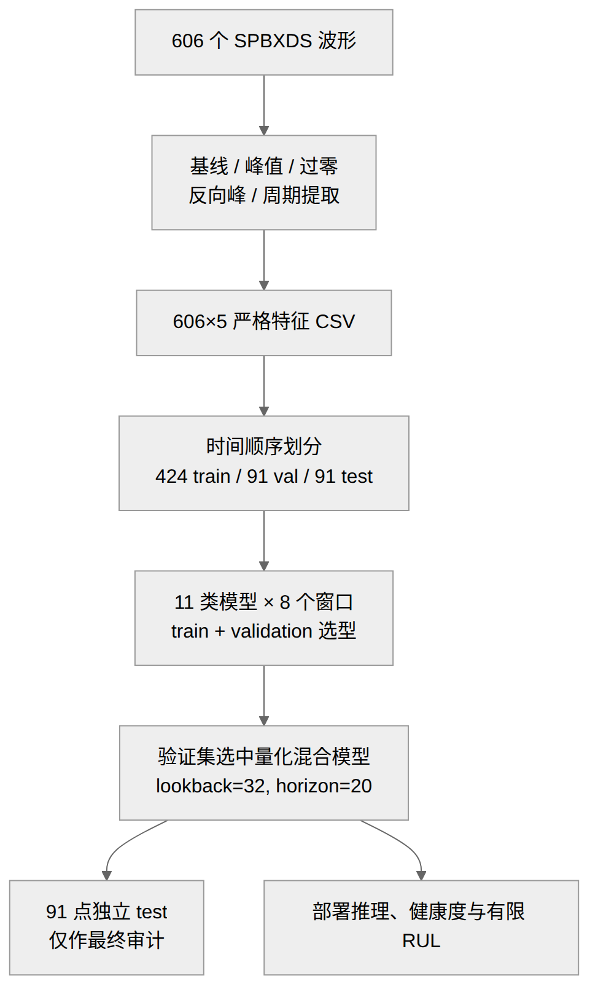

| 严格特征 | 提取/含义 | 离散水平数 |
|---|---|---:|
| <code>VoltageMaxRaw</code> | CH1 最大幅值 | 4 |
| <code>VoltageFirstZeroTimeUs</code> | 首次过零时间 | 19 |
| <code>VoltageReversePeakCoefficient</code> | 反向幅值与主幅值关系派生 | 5 |
| <code>VoltageMinAbsRaw</code> | 反向最小幅值绝对值 | 2 |
| <code>DischargePeriodSec</code> | 相邻放电周期 | 155 |

数据按时间严格划分为第 1–424 行训练、第 425–515 行验证、第 516–606 行独立测试；测试集不参与归一化、早停、窗口或模型选择。在正式 lookback=32、预测 20 步时，监督样本数为 373 / 91 / 91。单特征 <code>NMAE=MAE/训练段特征范围×100%</code>，五项取算术平均；归一化精度定义为 <code>max(0,100%-平均NMAE)</code>。普通 MAPE 会被接近零的真值严重放大，因此不作为主选择指标。

正式量化感知混合模型不是深度网络：主幅值取最近窗口上包络，首次过零取中位数，反向最小幅值取众数，反向峰系数由预测反向幅值/主幅值重建，周期取训练段有效周期中位数。24、32、48 步在验证 NMAE 上完全并列，预先约定的并列规则选择中间值 32。

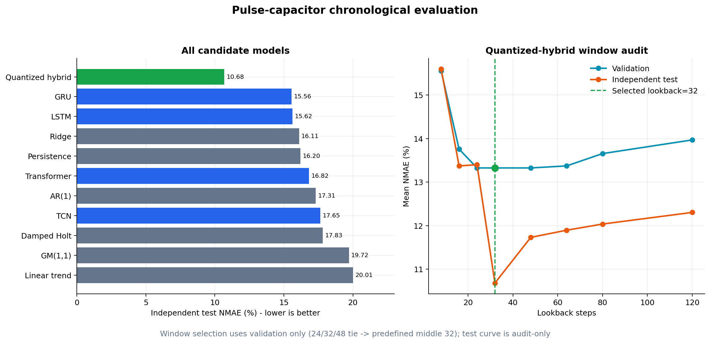

| 排名 | 模型 | lookback | 验证 NMAE | 独立测试 NMAE | 归一化精度 | 测试 sMAPE |
|---:|---|---:|---:|---:|---:|---:|
| 1 | 量化感知混合 | 32 | 13.3263% | **10.6830%** | **89.3170%** | 18.8084% |
| 2 | GRU | 32 | 19.1948% | 15.5578% | 84.4422% | 26.3446% |
| 3 | LSTM | 8 | 19.2521% | 15.6233% | 84.3767% | 26.5831% |
| 4 | Ridge | 8 | 19.1244% | 16.1051% | 83.8949% | 27.4657% |
| 5 | 持续值 | 8 | 17.6196% | 16.2027% | 83.7973% | 29.4058% |
| 6 | Transformer | 80 | 17.8636% | 16.8167% | 83.1833% | 27.1383% |
| 7 | AR(1) | 16 | 18.1148% | 17.3078% | 82.6922% | 30.9147% |
| 8 | TCN | 8 | 20.0741% | 17.6501% | 82.3499% | 30.1178% |
| 9 | 阻尼 Holt | 120 | 18.3142% | 17.8254% | 82.1746% | 32.1942% |
| 10 | GM(1,1) | 80 | 17.8531% | 19.7159% | 80.2841% | 33.1079% |
| 11 | 线性趋势 | 80 | 17.6732% | 20.0099% | 79.9901% | 34.4311% |

最佳混合模型在独立测试上比仅由验证集选中的持续值基线降低 5.5197 个 NMAE 百分点。验证集选中的深度架构是 Transformer；独立测试表现最好的深度架构是 GRU；总体部署模型仍然是量化感知混合模型，三者不能混写。

| 深度候选 | 架构 | 参数量 |
|---|---|---:|
| GRU | 单层 5→hidden32→LayerNorm→Linear5，末值残差 | 3,973 |
| LSTM | 单层 5→hidden32→LayerNorm→Linear5，末值残差 | 5,221 |
| TCN | 3 个残差时序块，32 通道，kernel 3，dilation 1/2/4；理论感受野 29，选中 lookback=8 时实际只观测 8 步 | 16,581 |
| Transformer | d_model=32，2 层 encoder，4 头，FFN 64，可学习位置向量，末值残差；参数量按选中 lookback=80 | 20,069 |

深度候选都联合输入/输出五个特征，在标准化空间预测“最后值 + 变化量”，输出头零初始化；训练采用 AdamW（lr=1e-3、weight_decay=1e-4）、MSE、全批、梯度裁剪 1.0、最多 250 epoch、验证早停 patience 25，并对种子 11 / 23 / 37 的三个模型取平均。

其他候选方法也在同一时间划分下比较：GM(1,1) 对每个特征做 AGO 与指数响应；持续值保持窗口末值；线性趋势以窗口最小二乘直线外推；阻尼 Holt 在 α∈{0.2,0.5,0.8}、β∈{0.1,0.3,0.6}、φ∈{0.8,0.9,0.98} 中按窗口内一步 SSE 选择；AR(1) 把系数裁剪到 [-1,1]；Ridge 将 L×5 展平后联合预测相对末值的五维增量，并只用 validation 从惩罚 {0.01,0.1,1,10} 中选出最终 10。

| 特征 | 独立测试 MAE | NMAE | sMAPE |
|---|---:|---:|---:|
| 最大幅值 | 0 | 0% | 0% |
| 首次过零 | 0.00184066 μs | 6.5738% | 0.6322% |
| 反向峰系数 | 0.00195544 | 22.4902% | 46.1435% |
| 反向最小幅值 | 58.84615 raw | 23.0769% | 45.7947% |
| 放电周期 | 0.0791099 s | 1.2741% | 1.4719% |

最大幅值零误差来自测试段恰好处于量化平台，不能解释成连续模拟量 100% 准确；反向最小幅值仅 2 档，反向峰系数由量化幅值比值派生并只有 5 个水平，两项都明显受 ADC 量化限制。

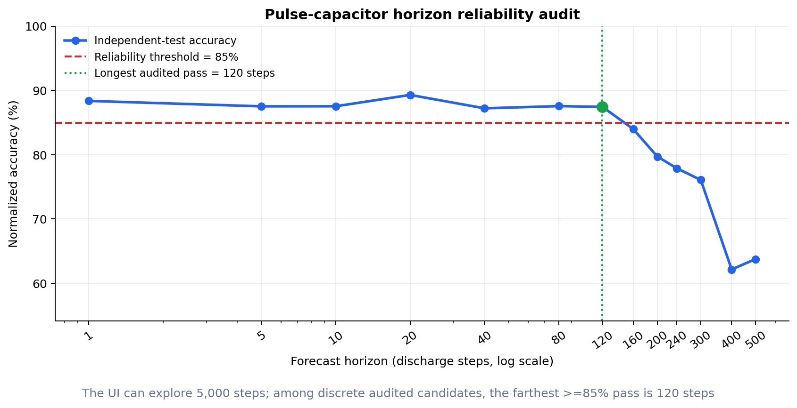

多时距独立回测的归一化精度为：20 步 89.3170%、120 步 87.4561%、160 步 83.9925%。规则要求精度至少 85% 且测试点至少 30 个；在 1、5、10、20、40、80、120、160 等离散候选时距中，最远通过门槛的是 120 步（本批序列内部滚动留出），这不表示 1–120 的每一个时距都逐一验证过。

当前页面默认样例没有一致、可检测的失效趋势，结论是“有限寿命暂不可辨识”：剩余寿命只能写 >120 步（以约 5.4 s 中位周期计约 10.8 分钟），总寿命 >726 步；5,000 步只是未验证探索外推，不能当成寿命承诺。

运行时权威健康基准是原始第 1 次放电，周期采用第 2 行首个有效间隔：五项依次为 29,696、0.314 μs、1e-6、1 raw、5.968 s。静态 <code>strict_deep_report.json</code> 仍保留旧的 <code>healthyBaselineRows=32</code> 生成字段，8890 API 会在返回前覆盖这些基准；查看页面结果时应以 API 的 <code>baselineDefinition</code> 和运行时字段为准。

失效试验口径是 606 次观测后再运行 1,500 次失效，总失效行 2,106。只有最大幅值和首次过零两项用该标签反标：29,696 上升 6.98% 得阈值 31,768.7808，0.314 μs 下降 23.32% 得阈值 0.2407752 μs；其余三项仅作可靠度/趋势辅助，其中 1e-6 与 1 raw 是正值 floor，不是已标定失效阈值。该失效标签用于阈值标定，不能再当独立寿命准确率证据。

上述五张模型图由仓库内指标与正式 artifact 复算生成，可重复执行：

~~~bash
.venv/bin/python scripts/generate_readme_model_figures.py
~~~

架构和请求链采用仓库内静态 PNG，避免 GitHub 或离线 Markdown 阅读器因 Mermaid 版本差异出现 `Unable to render rich display`；对应可编辑源文件保存在 `docs/diagrams/*.mmd`。

## 常用训练与推理

自由程训练参数：

```bash
.venv/bin/python freepath_service/train_unified_free_path_model.py --help
```

Z-pinch 单点推理：

```bash
.venv/bin/python zpinch/predict_current.py \
  --I 50 --tr 300 --liner-r 5 --foam-r 0.6 --m 30 --Z 13
```

Z-pinch 重新优化：

```bash
.venv/bin/python zpinch/optimize_zpinch_velocity_first.py
```

脉冲电容器严格模型重训：

```bash
.venv/bin/python pulse_capacitor_online_eval/tools/train_strict_deep_models.py --help
```

## FLASH 便携环境

GitHub 克隆默认没有 `FLASH4.8/`。只有从 Flash Center 合法取得代码并放到仓库根目录后，才执行本节命令；现有本地便携副本已完成下述链接修复。

预编译 FLASH 文件依赖原机器的 Linux x86-64、MPI、HDF5、HYPRE、Fortran 和 CUDA ABI。换机器后先加载环境并做重建 dry-run：

```bash
source scripts/flash_env.sh
.venv/bin/python scripts/rebuild_flash_project.py improved_MRT --dry-run
```

确认工具链后才执行实际重建：

```bash
.venv/bin/python scripts/rebuild_flash_project.py improved_MRT --jobs 8
```

便携链接审计：

```bash
.venv/bin/python scripts/repair_flash_symlinks.py
```

当前 73,285 个符号链接已全部改为便携包内目标：旧机器链接 0、断链 0、越出包目录 0。这里的检查不等于已在目标机器完成 MPI/CUDA 仿真验证；仓库不会自动启动 FLASH 仿真。

## API 示例

健康检查：

```bash
curl -fsS http://127.0.0.1:8790/health
```

FLASH 接入控制状态：

```bash
curl -fsS http://127.0.0.1:8790/api/flash/control
```

接口失败、未启用元素、范围外数据或未训练材料必须回退原 opacity 表，不能强行外推。

## 完整目录

```text
free_path_service_portable/
├── freepath_service/             # 8790 主服务、自由程训练/推理、正式模型与数据
├── pulse_capacitor_online_eval/  # 8890 服务、实验 CSV、训练工具与报告
├── zpinch/                       # 当前 velocity-first 模型、训练和推理
├── archive_zpinch10000/          # 历史 Z-pinch 研究资产
├── FLASH4.8/                     # 仅本地可选；Git 忽略，不上传 GitHub
├── cli-anything-flash/           # FLASH CLI harness
├── Cuba-4.2.2/                   # Cuba 源码、头文件与静态库
├── docs/diagrams/                # README 静态架构图的可编辑 Mermaid 源
├── scripts/                      # 环境、自检、等待、FLASH 修复/重建工具
├── output/playwright/            # README 实际页面截图
├── output/model-docs/            # 模型效果图与静态架构 PNG
├── Dockerfile / compose.yaml     # 容器运行
├── setup.sh / start_all.sh       # 原生安装与启动
├── stop_all.sh / status.sh       # 停止与状态
├── SHA256SUMS                    # 逐文件完整性校验
└── SYMLINKS.txt                  # 本地 FLASH 链接清单；Git 忽略
```

更细清单见 [PORTABLE_CONTENTS.md](PORTABLE_CONTENTS.md)；本地 FLASH 整理范围见 [FLASH_PORTABLE_EXCLUSIONS.md](FLASH_PORTABLE_EXCLUSIONS.md)。

## 从 GitHub 获取应用工程（不含 FLASH 本体）

大型模型、训练数据和预编译二进制使用 Git LFS。只下载普通 Git 对象会得到 LFS 指针，不是可运行文件：

```bash
git lfs install
git clone https://github.com/NiubilityZXC/free-path-service-portable.git
cd free-path-service-portable
git lfs pull
git lfs ls-files
```

随后执行完整性和离线模型自检：

```bash
sha256sum -c SHA256SUMS --quiet
.venv/bin/python scripts/portable_smoke_test.py
```

GitHub 仓库保持私有；`FLASH4.8/` 明确不上传。专利文件、原始实验数据、第三方源码和模型权重仍应按各自授权使用。

## 排障

### 8790 为什么会停止？

旧服务由手工 `nohup` 启动，没有 systemd 或容器重启策略；主机重启后不会自动恢复。当前原生脚本使用受控 PID，Docker Compose 还提供重启恢复。

### 端口没有监听

```bash
./status.sh
ss -ltnp 'sport = :8790 or sport = :8890'
```


若 `status.sh` 显示 PID 失效但 HTTP 正常，说明端口由 Docker 或其他进程提供，不受 `stop_all.sh` 管理。先用 `docker ps` / `ss -ltnp` 确认占用者，不要重复启动；`start_all.sh` 会在健康检查后再次核对本次 PID，端口冲突时明确失败并回滚新进程。

### 模型文件只有百余字节

这是尚未下载的 Git LFS 指针。执行 `git lfs pull`，再运行 `git lfs fsck`。

### FLASH 可执行文件启动失败

该目录只存在于本地授权副本。确认 MPI/HDF5/HYPRE/CUDA ABI；不匹配时按项目 `setup_call` 重编。

## 验证范围

- Shell 与 Python 语法检查通过。
- Docker Compose 配置检查通过。
- 自由程统一模型、禁用高 Z 路由、Z-pinch 正式模型和电容报告的便携 smoke test 通过。
- 逐文件 SHA256 与关键运行资产抽查通过。
- 73,285 个符号链接已验证不依赖包外旧机器路径。
- `8790/health` 返回 `{"ok": true}`，`8890` 返回 HTTP 200。

这些检查不构成物理模型外部验证，也不表示预编译 FLASH 二进制能跨 ABI 直接运行。

## 延伸文档

- [便携运行详细说明](README_便携运行.md)
- [内容清单](PORTABLE_CONTENTS.md)
- [未携带的大型资产](EXCLUDED_LARGE_ARTIFACTS.md)
- FLASH 本体说明：仅见本地授权副本 `FLASH4.8/README.md`
- [FLASH 排除清单](FLASH_PORTABLE_EXCLUSIONS.md)
- FLASH 运行依赖：仅见本地授权副本 `FLASH4.8/PREREQUISITES_PORTABLE.md`
