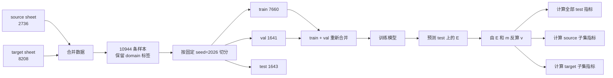
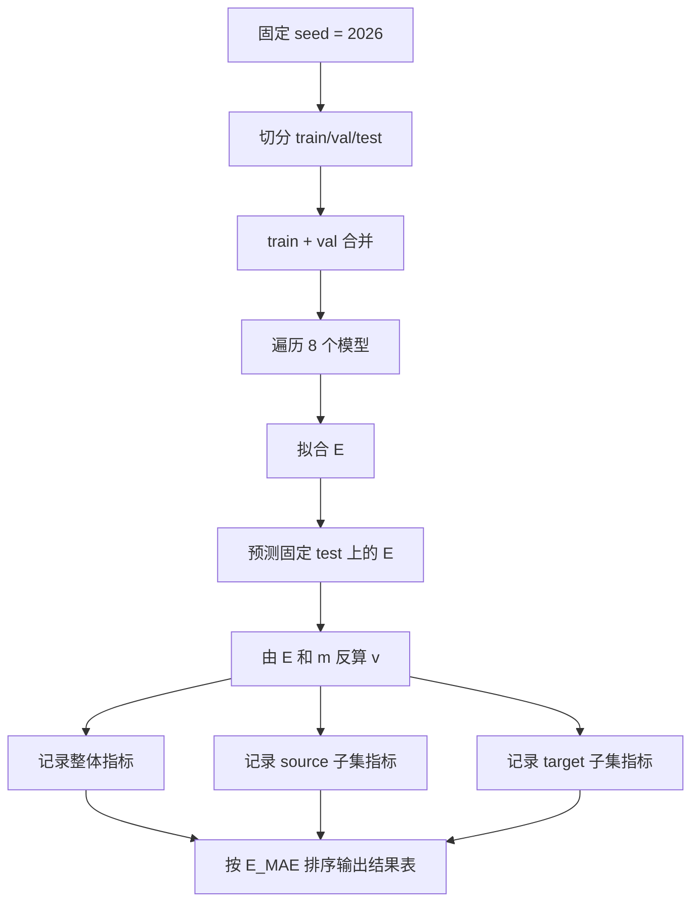

# 合并训练结果解读

## 1. 先回答最关键的 4 个问题

### 1.1 数据集怎么划分

`zpinch10000` 当前主线是把 Excel `零维表格转换 (2).xlsx` 里的两个 sheet 合并后训练：

- `对应优化质量`：`2736` 条
- `丝阵质量20_30_40mgcm`：`8208` 条
- 合并后总样本数：`10944`

切分函数 `train_val_test_split()` 的规则是固定的：

- `70% train`
- `15% val`
- `15% test`

对 `10944` 条样本，实际整数切分结果是：

- `train = 7660`
- `val = 1641`
- `test = 1643`

但要注意一个细节：

- 在最终打分阶段，代码会把 `train + val = 9301` 合并后重新训练
- 最终分数只在 `test = 1643` 上计算

所以最终正式评测的口径，更接近：

- `85%` 参与训练
- `15%` 保留为独立测试

### 1.2 结果是一次实验还是多次实验

这份正文统一只看两条线：

1. 新版：`/home/user/zpinch10000/train_all_data_combined_xlsx_standalone.ipynb`
   - 这是 **单次固定测试**
   - 固定 `SEED = 2026`
   - 结果来自同一份固定 `test` 集

2. 旧版：`/home/user/zpinch10000/train_missing_models_on_xlsx.py`
   - 这是“只用 `2736` 条 source 数据训练”的旧方案
   - 结果文件里同时包含：
   - `source` 内部随机划分结果
   - `source` 训练后直接测试 `target` 的外部测试结果

所以这篇解读里最准确的说法是：

- 新版“所有数据”结果是 **单次固定测试结果**
- 旧版 `2736` 条结果则分成“source 内部结果”和“target 外部测试结果”两种

通俗地说：

- 新版像是“固定拿同一张试卷考一次”
- 旧版里的 `source_random_split` 像是“把试卷随机抽 3 次，再把 3 次成绩求平均”

### 1.3 结果里的数值到底代表什么

这个项目始终只训练一个回归目标：

- 预测动能 `E`

速度 `v` 不是单独训练出来的，而是由预测动能和输入质量反算：

```text
v_hat = -sqrt(2e16 * E_hat / m)
```

因此结果表里：

- `E_MAE / E_RMSE / E_MAPE_percent` 表示模型对动能 `E` 的预测误差
- `v_MAE / v_MAPE_percent` 表示“动能误差传导到速度后”的误差

也就是说：

- 这里没有第二个“速度模型”
- `v` 只是 `E` 的派生评估指标

### 1.4 为什么有的地方只有 4 个模型，有的地方有 8 个模型

这也是当前目录里最容易混淆的一点。

旧版 `2736` 条代码 `/home/user/zpinch10000/train_missing_models_on_xlsx.py` 里是 4 个树模型：

- `RandomForest`
- `LightGBM`
- `XGBoost`
- `CatBoost`

独立版 notebook `/home/user/zpinch10000/train_all_data_combined_xlsx_standalone.ipynb` 里是 8 个模型：

- `PowerLaw`
- `Poly2Ridge`
- `KNN`
- `MLP`
- `RandomForest`
- `LightGBM`
- `XGBoost`
- `CatBoost`

所以：

- 如果你看旧版 `2736` 条结果，它对应的是 **4 模型旧代码口径**
- 如果你看 standalone notebook 的固定测试结果，它对应的是 **8 模型 notebook 口径**

---

## 2. 数据、输入特征和预测目标

### 2.1 原始列

每条样本原始上有这 7 列数值：

- 电流 `I`
- 上升时间 `tr`
- 套筒半径 `liner_r`
- 泡沫半径 `foam_r`
- 套筒质量 `m`
- 动能 `E`
- 速度 `v`

其中：

- 输入的基础变量是前 5 个物理量再加一个常数列 `Z=13`
- 输出标签只用 `E`

基础输入向量是：

```text
x_base = [I, tr, liner_r, foam_r, m, Z]
```

### 2.2 特征工程后的训练输入

真正送进模型的不是只有 6 维基础输入，而是扩展成了 14 维：

```text
x = [
  I,
  tr,
  liner_r,
  foam_r,
  m,
  Z,
  foam_r / liner_r,
  liner_r - foam_r,
  pi * (liner_r^2 - foam_r^2),
  I / tr,
  I * liner_r,
  I * foam_r,
  tr * liner_r,
  tr * foam_r
]
```

训练目标始终是：

```text
y = E
```

整个学习任务可以写成：

```text
E_hat = f_theta(x)
```

再由物理公式得到：

```text
v_hat = -sqrt(2e16 * E_hat / m)
```

---

## 3. 数据集划分流程图

### 3.1 主流程图



### 3.2 固定测试集构成

这份 standalone notebook 固定用：

- `SEED = 2026`

因此它只有一份固定测试集，大小是：

| test 总数 | source 子集 | target 子集 |
| ---: | ---: | ---: |
| `1643` | `407` | `1236` |

这也解释了为什么：

- 总体指标会更接近 `target` 子集指标
- 因为这份固定测试集里本来就是 `target` 占多数

### 3.3 `val` 集到底有没有参与训练

这里只按 standalone notebook 来说：

- 画损失曲线时，`MLP / LightGBM / XGBoost / CatBoost` 会把 `val` 作为可视化参考
- 但最终正式结果表里，每个模型仍然是 `train + val` 合并后重新训练，再在 `test` 上评测

所以如果要一句话概括：

- `val` 在这个项目里主要用于“训练过程观察”
- 不是最终结果表里的独立评分集

---

## 4. 之前只训练 `2736` 条 source 数据的结果怎么读

### 4.1 旧方案到底是什么

你这次提到的“之前只训练了 `2736` 条”，对应的是旧代码：

- `/home/user/zpinch10000/train_missing_models_on_xlsx.py`

它只使用：

- `source sheet = 对应优化质量`
- 样本数 `2736`

这一部分旧结果主要看 3 个文件：

- `/home/user/ai_xlsx_cross_test_outputs/summary_metrics.json`
- `/home/user/ai_xlsx_cross_test_outputs/source_random_split_metrics.csv`
- `/home/user/ai_xlsx_cross_test_outputs/target_external_test_metrics.csv`

这个旧方案实际上做了两类评估：

1. `source_random_split_summary`
   - 只在这 `2736` 条 `source` 数据内部做随机划分
   - 看的是“source 域内部插值能力”

2. `target_external_test_summary`
   - 仍然只用这 `2736` 条 `source` 数据训练
   - 但测试时直接去测 `8208` 条 `target` 数据
   - 看的是“从 source 迁移到 target 的跨域泛化能力”

所以旧结果本来就有两个完全不同的含义：

- 一个是“表内随机切分”
- 一个是“跨表外部测试”

### 4.2 旧方案在 `source` 内部为什么分数特别好

旧方案在 `source_random_split_summary` 里的结果非常漂亮，例如：

| model | E_MAE | E_MAPE_percent |
| --- | ---: | ---: |
| `RandomForest` | `0.0001605` | `0.0031%` |
| `LightGBM` | `0.0008091` | `0.0159%` |
| `XGBoost` | `0.0003850` | `0.0082%` |
| `CatBoost` | `0.0026855` | `0.0568%` |

这些结果说明的是：

- 只在 `source` 这张表内部随机切分时，模型几乎可以做非常精细的插值
- `source` 这部分数据分布更规则、更单纯，也更接近“同分布训练、同分布测试”

但这类分数不能直接理解成：

- 模型已经具备了对新质量点、新分布或新 sheet 的泛化能力

更准确地说，它说明的是：

- 旧模型对 `source` 域内部样本拟合得非常好
- 但这只是“单域内部插值很强”

### 4.3 旧方案为什么一到 `target` 就几乎失效

旧方案最值得解释的，其实不是 source 内部结果，而是它的外部测试结果。

当时 4 个树模型只用 `2736` 条 `source` 训练，然后直接去测 `8208` 条 `target`，结果是：

| model | target 外测 E_MAE | target 外测 E_MAPE_percent |
| --- | ---: | ---: |
| `RandomForest` | `2.0350` | `188.7317%` |
| `LightGBM` | `2.0353` | `188.7681%` |
| `XGBoost` | `2.0353` | `188.7605%` |
| `CatBoost` | `2.0355` | `188.8021%` |

这组结果的含义非常明确：

- 旧方案虽然在 `source` 内部很准
- 但一旦测试分布切换到 `target`，误差会暴涨
- 说明旧模型几乎没有学会 `target` 域的质量变化规律

所以旧方案的最准确结论不是“模型很好”，而是：

- 对 `source` 域内插值很好
- 对 `target` 域跨表泛化很差

### 4.4 为什么旧方案会这样

根本原因不是模型太弱，而是训练数据的信息不够。

旧方案只看到了 `source` 的 `2736` 条样本，因此：

- 没看见 `target` 这张表里的真实分布
- 没看见 `20/30/40 mg/cm` 这部分目标域数据
- 同一组工况下，可供学习的质量变化信息也更少

于是模型学到的更像是：

- `source` 这张表自己的规律

而不是：

- 对更广泛质量范围和目标域工况都成立的规律

### 4.5 旧版这 3 个结果文件分别看什么

- `summary_metrics.json`
  - 是旧版结果的总汇总
- `source_random_split_metrics.csv`
  - 看旧版在 `source` 域内部随机切分时的效果
- `target_external_test_metrics.csv`
  - 看旧版只用 `source` 训练、再直接测试 `target` 时的效果

### 4.6 “随机平均”到底是什么意思

旧版 `2736` 条代码里，`source_random_split` 不是只切一次，而是换 3 次随机种子重复做。

通俗地说，就是：

- 第一次随机切一张训练集/测试集
- 算一次指标
- 再重新打乱数据切第二次
- 再算一次
- 最后把 3 次结果求平均

这样做的原因很简单：

- 不想让一次“运气好的切分”把结果吹得太漂亮
- 也不想让一次“运气差的切分”把结果压得太低

举个演示例子：

假设某个模型在 3 次随机切分上的 `E_MAE` 分别是：

```text
第 1 次: 0.00012
第 2 次: 0.00015
第 3 次: 0.00021
```

那么最后表里写的随机平均就是：

```text
(0.00012 + 0.00015 + 0.00021) / 3 = 0.00016
```

所以表里的一个平均指标，本质上就是：

- “这个模型换 3 次切法以后，平均大概能做到什么水平”

这也是为什么旧版 `source_random_split_metrics.csv` 更像是：

- 稳定性结果

而不是：

- 单次考试结果

---

## 5. 按独立版 Notebook 解读的最新合并训练结果

### 5.1 这部分统一看哪几个输出

按你的要求，下面“所有数据”的解读统一只按：

- `/home/user/zpinch10000/train_all_data_combined_xlsx_standalone.ipynb`

这份独立版 notebook 来理解。

它对应的输出口径是固定的：

- 固定随机种子：`SEED = 2026`
- 先按 `70% train / 15% val / 15% test` 划分
- 正式打分时把 `train + val` 合并后重新训练
- 最终只在这一份固定 `test` 上评估

这份 notebook 计划输出的核心文件是：

- `ai_xlsx_all_in_training_outputs_standalone/combined_fixed_split_metrics_standalone.csv`
- `ai_xlsx_all_in_training_outputs_standalone/combined_fixed_split_source_target_metrics_standalone.csv`
- `ai_xlsx_all_in_training_outputs_standalone/fig_training_loss_curves_standalone.png`
- `ai_xlsx_all_in_training_outputs_standalone/standalone_summary.json`

因此这里的“所有数据结果”应理解为：

- 合并后数据集上的 **单次固定测试结果**
- 不是其它汇总口径下的随机平均结果

### 5.2 指标公式

动能误差：

```text
E_MAE = (1 / n) * sum_j |E_hat_j - E_j|
```

```text
E_RMSE = sqrt((1 / n) * sum_j (E_hat_j - E_j)^2)
```

```text
E_MAPE = (1 / n) * sum_j |(E_hat_j - E_j) / E_j| * 100%
```

速度误差：

```text
v_hat_j = -sqrt(2e16 * E_hat_j / m_j)
```

```text
v_MAE = (1 / n) * sum_j |v_hat_j - v_j|
```

```text
v_MAPE = (1 / n) * sum_j |(v_hat_j - v_j) / v_j| * 100%
```

理解时最重要的几点是：

- `MAE` 看平均绝对偏差
- `RMSE` 对大误差更敏感
- `MAPE` 看相对误差百分比

再举一个非常直观的小例子。

假设测试集中只有 3 个样本，真实动能和预测动能分别是：

```text
真实 E = [5.0, 4.0, 6.0]
预测 E = [4.7, 4.2, 5.4]
```

那么：

```text
E_MAE = (|4.7-5.0| + |4.2-4.0| + |5.4-6.0|) / 3
      = (0.3 + 0.2 + 0.6) / 3
      = 0.3667
```

```text
E_RMSE = sqrt((0.3^2 + 0.2^2 + 0.6^2) / 3)
       = sqrt((0.09 + 0.04 + 0.36) / 3)
       = sqrt(0.1633)
       ≈ 0.4041
```

```text
E_MAPE = (6% + 5% + 10%) / 3 = 7%
```

所以通俗地说：

- `MAE` 像“平均每题差多少分”
- `RMSE` 像“特别离谱的大错会被额外放大”
- `MAPE` 像“平均相对偏差百分之多少”

### 5.3 固定测试结果怎么读

独立版 notebook 的核心结果是 8 个模型在同一个固定测试集上的统一比较。

这份固定测试集里：

- `train = 7660`
- `val = 1641`
- `test = 1643`
- 其中 `source test = 407`
- `target test = 1236`

8 个模型在固定测试集上的主要结果可以概括成：

- `LightGBM` 的 `E_MAE` 最小：`0.1122`
- `RandomForest` 的 `E_MAPE` 最小：`6.8456%`

因此独立版 notebook 本身给出的最自然结论就是：

- 按绝对误差看，`LightGBM` 是这次固定测试的第一名
- 按相对误差看，`RandomForest` 是这次固定测试的第一名

这并不矛盾，因为：

- `MAE` 和 `MAPE` 关注的不是同一件事
- 一个模型可以在绝对误差更优，但在相对误差上不一定最优

### 5.4 `source / target` 子集结果怎么读

独立版 notebook 会在同一个固定测试集里，再把测试样本按来源拆成：

- `source`
- `target`

这里不是重新训练两次，而是：

- 同一个模型
- 同一批测试预测
- 只是按来源分开统计

从这份子集结果里，最重要的现象是：

- `source` 子集误差明显更低
- `target` 子集误差明显更高

例如 `RandomForest`：

- `source` 子集 `E_MAPE = 0.3792%`
- `target` 子集 `E_MAPE = 8.9750%`

例如 `LightGBM`：

- `source` 子集 `E_MAE = 0.0453`
- `target` 子集 `E_MAE = 0.1343`

所以独立版 notebook 口径下，更准确的说法是：

- 模型已经可以比较稳地处理合并后的总分布
- 但 `target` 这部分新增分布仍然明显更难

### 5.5 损失曲线怎么读

独立版 notebook 还会画出：

- `MLP`
- `LightGBM`
- `XGBoost`
- `CatBoost`

这 4 个模型的训练损失曲线。

之所以只有它们，是因为：

- 它们有显式的逐轮训练过程
- `PowerLaw / Poly2Ridge / KNN / RandomForest` 没有标准的逐轮 loss 历史

这张图的作用主要是：

- 看训练过程是否稳定
- 看 train / valid 曲线是否明显分离
- 辅助判断模型是不是在固定切分上学得过快或过慢

### 5.6 按独立版 Notebook 解读时，要注意的边界

既然这里统一按独立版 notebook 来解读，就要同时接受它的边界：

- 它回答的是“固定测试集上的单次结果”
- 它不直接回答“多次随机划分平均后谁最稳”
- 它也不直接回答“未见质量值外推到底有多强”

所以这部分最稳妥的结论应该是：

- 独立版 notebook 证明了合并训练后，在这份固定测试集上，`LightGBM` 和 `RandomForest` 表现最好
- 其中 `LightGBM` 更偏向绝对误差最优，`RandomForest` 更偏向相对误差最优

---

## 6. 最新结果和之前相比，有什么区别，提升了哪些地方

### 6.1 最大的区别：训练目标从“单域拟合”变成了“合并域学习”

旧方案：

- 只用 `2736` 条 `source` 训练
- 本质上更像“source 域内部插值 + 跨域外测”

新方案：

- 用 `2736 + 8208 = 10944` 条合并训练
- 训练时直接让模型看到 `source + target` 两个域

数据层面的关键变化是：

- 样本数从 `2736` 提升到 `10944`
- 同一固定工况下的质量点数，中位数从 `1` 提升到 `4`
- 质量点覆盖由单点为主，变成对 `20/30/40 mg/cm` 都有显式观测

这意味着模型现在学到的，不再只是：

- `source` 内部的局部规律

而是开始学习：

- 同一工况下，质量变化时 `E` 怎么变化
- `target` 域内部的真实分布

### 6.2 提升最大的地方：`target` 域能力大幅增强

如果拿“旧方案的 target 外部测试”去对比“独立版 notebook 固定测试里的 target 子集结果”，可以看到最明显的提升：

| model | 旧方案 target E_MAPE | 新方案 target E_MAPE | 相对下降 |
| --- | ---: | ---: | ---: |
| `RandomForest` | `188.7317%` | `8.9750%` | `95.24%` |
| `LightGBM` | `188.7681%` | `9.6035%` | `94.91%` |
| `XGBoost` | `188.7605%` | `10.2709%` | `94.56%` |
| `CatBoost` | `188.8021%` | `13.5412%` | `92.83%` |

如果看 `E_MAE`，下降也同样明显：

- `RandomForest`: `2.0350 -> 0.1466`，下降约 `92.80%`
- `LightGBM`: `2.0353 -> 0.1343`，下降约 `93.40%`
- `XGBoost`: `2.0353 -> 0.1453`，下降约 `92.86%`
- `CatBoost`: `2.0355 -> 0.1895`，下降约 `90.69%`

这说明新方案真正提升的核心不是：

- `source` 内部再多提一点精度

而是：

- 目标域从“几乎不会做”变成“已经能较稳定预测”

### 6.3 提升具体体现在哪些能力上

可以把提升概括成 3 类：

1. `target` 域内插值能力显著提升
   - 旧方案对 `target` 外测接近失效
   - 新方案在 `target` 子集上已经能做到 `9%~14%` 左右的 `E_MAPE`

2. 质量维度的可学习性显著增强
   - 旧方案训练时几乎没法充分学习“同工况下换质量会怎样”
   - 新方案因为同工况下有更多质量点，模型终于能从数据里学到这条关系

3. 低动能和目标域分布覆盖增强
   - 新增样本把目标域真实分布带进了训练集
   - 模型不再只熟悉 `source` 域那一小块分布

### 6.4 不是所有指标都变得更漂亮，这点也要诚实说明

如果只看最简单的 `source` 域内部拟合，旧方案反而会更漂亮。

例如 `RandomForest`：

- 旧方案 `source_random_split` 的 `E_MAPE = 0.0031%`
- 新方案独立版 notebook 里 `source` 子集的 `E_MAPE = 0.3792%`

这并不代表新方案“退步了很多”，更准确的解释是：

- 旧方案只需要处理一个更单纯、更规则的 source 域
- 新方案要同时兼顾更复杂的 `source + target` 联合分布
- 因此 source 内部那种“极致低误差”不再是主要目标

所以应该这样理解：

- 旧方案赢在“单域内部拟合极致”
- 新方案赢在“目标域可用性和整体泛化范围大幅提升”

### 6.5 仅按独立版 Notebook 解读时，还有哪些问题无法回答

如果严格只按独立版 notebook 来解读，它能支持的结论主要是：

- 固定测试集上的模型优劣
- `source / target` 子集的难度差别
- 合并训练后 `target` 域能力相比旧方案明显提升

但它不能单独回答的是：

- 多次随机划分平均后谁最稳
- 对完全未见质量值的强外推到底有多强
- 对未见工况整组留出的强泛化到底有多强

所以如果这份文档后面只按独立版 notebook 来写，最稳妥的表述应当是：

- 新版已经显著提升了 `target` 域内预测能力
- 但“强外推能力是否已经解决”这件事，不能只靠这份 notebook 下结论

### 6.6 一句话比较旧版和新版

如果要一句话概括两代结果的区别，可以这样写：

- 旧版 `2736` 条 source-only 训练，属于“source 域内很准、target 域几乎失效”
- 新版 `10944` 条合并训练，属于“source 内部极致精度有所让位，但 target 域能力和整体适用范围大幅提升”

### 6.7 为什么要选这 8 个模型

之所以不是只挑一个模型来训，而是同时放 `PowerLaw / Poly2Ridge / KNN / MLP / RandomForest / LightGBM / XGBoost / CatBoost`，目的其实很实际：

- 我们并不知道这组数据到底更像“物理公式型关系”、还是“局部相似型关系”、还是“树模型更擅长的分段非线性关系”
- 所以最稳妥的做法不是先拍脑袋，而是让不同类型的模型都来试一次

可以把这 8 个模型分成 4 类来理解：

1. 简单、可解释模型
   - `PowerLaw`
   - `Poly2Ridge`
   - 目的：先看一个比较像公式的模型能不能已经解释大部分规律

2. 局部插值模型
   - `KNN`
   - 目的：看“离得近的样本像不像”这条思路是否足够

3. 神经网络模型
   - `MLP`
   - 目的：给一个更自由、更强表达能力的非线性模型做对照

4. 树模型和提升树模型
   - `RandomForest / LightGBM / XGBoost / CatBoost`
   - 目的：这是表格数据里最常见、也往往最强的一类模型，必须重点比较

通俗地说，这 8 个模型其实是在回答 4 个问题：

- 这组数据更像“公式关系”吗？
- 更像“邻居相似”吗？
- 更像“神经网络才能学出来的复杂函数”吗？
- 还是更像“树模型切几刀就能切清楚”的关系？

---

## 7. 训练的数学公式

### 7.1 统一训练目标

所有模型都在做同一件事：

```text
E_hat = f_theta(x)
```

评估时再把 `E` 映射到 `v`：

```text
v_hat = -sqrt(2e16 * E_hat / m)
```

### 7.2 PowerLaw

```text
log(E_hat) = b0 + sum_i [bi * log(x_i + s_i)]
```

等价于：

```text
E_hat = exp(b0) * product_i (x_i + s_i)^(b_i)
```

训练方式：

- 在 `log` 空间做线性回归
- 再用一个很小的 Ridge 正则项稳定求解

通俗解释：

- 它先把“乘法关系”变成“加法关系”
- 然后去学“哪个输入变大时，E 会按幂次放大或缩小”

数字例子：

假设模型已经学到：

```text
log(E_hat) = 1.0 + 0.5 * log(4) - 0.25 * log(16)
```

因为：

```text
log(4) ≈ 1.3863
log(16) ≈ 2.7726
```

所以：

```text
log(E_hat) = 1.0 + 0.5 * 1.3863 - 0.25 * 2.7726
          = 1.0
E_hat = exp(1.0) ≈ 2.7183
```

也就是说，这个模型的训练本质上是在不断调整 `b0, b1, ...`，让很多样本的 `log(E_hat)` 尽量贴近真实 `log(E)`。

### 7.3 Poly2Ridge

```text
E_hat = w0 + sum_i (wi * z_i) + sum_i (wii * z_i^2) + sum_{i<j} (wij * z_i * z_j)
```

目标函数：

```text
min over w: ||y - Xw||^2 + alpha * ||w||^2
```

其中：

- `z_i` 是标准化后的输入
- `alpha = 1e-2`

通俗解释：

- 它比普通线性回归更灵活，因为它不仅看一次项，还看平方项和交叉项
- 但又不会像完全自由的模型那样太容易乱拟合，因为还有 `Ridge` 正则压着系数

数字例子：

假设标准化后只有两个输入：

```text
z1 = 1.0
z2 = -0.5
```

模型系数是：

```text
E_hat = 4.0 + 0.3*z1 - 0.2*z2 + 0.1*z1^2 - 0.05*(z1*z2)
```

代入可得：

```text
E_hat = 4.0 + 0.3*1.0 - 0.2*(-0.5) + 0.1*1.0^2 - 0.05*(1.0*(-0.5))
      = 4.0 + 0.3 + 0.1 + 0.1 + 0.025
      = 4.525
```

训练时它做的事，就是不断改这些系数，让全体样本的平方误差更小，同时不让系数变得过大。

### 7.4 KNN

```text
E_hat(x) = [sum over i in N_k(x) of (w_i * E_i)] / [sum over i in N_k(x) of w_i]
w_i = 1 / max(d(x, x_i), epsilon)
```

当前参数：

- `k = 8`

通俗解释：

- 它不先学一个总公式
- 它的思路是：“你这个新样本最像历史上的哪几个样本？那就参考它们的 E”

数字例子：

假设某个新样本最接近 3 个历史点，它们的距离和动能分别是：

```text
邻居1: 距离 0.2, E = 4.8
邻居2: 距离 0.5, E = 5.0
邻居3: 距离 1.0, E = 5.2
```

那么权重就是距离倒数：

```text
w1 = 1 / 0.2 = 5
w2 = 1 / 0.5 = 2
w3 = 1 / 1.0 = 1
```

最后预测值：

```text
E_hat = (5*4.8 + 2*5.0 + 1*5.2) / (5 + 2 + 1)
      = (24 + 10 + 5.2) / 8
      = 4.9
```

所以 KNN 的“训练”其实很轻，重点不在学参数，而在预测时找邻居。

### 7.5 MLP

网络结构是两层隐藏层：

```text
E_hat(x) = W3 * sigma(W2 * sigma(W1 * x + b1) + b2) + b3
```

其中激活函数是 `ReLU`：

```text
sigma(z) = max(z, 0)
```

损失函数是均方误差：

```text
L = (1 / n) * sum_j (E_hat_j - E_j)^2
```

当前参数：

- 隐层宽度：`64 -> 32`
- 学习率：`1e-3`
- 训练轮数：`220 epochs`
- 优化器：`Adam`

通俗解释：

- 它像是一层层做非线性变换
- 前一层先把输入揉一遍，后一层再继续揉，最后输出一个 `E_hat`

数字例子：

真实模型是 `64 -> 32 -> 1`，这里用一个极简的 1 个隐藏神经元例子说明训练过程。

假设标准化后的两个输入是：

```text
x1 = 1.0
x2 = -0.5
```

第一层参数：

```text
W1 = [0.8, -0.2]
b1 = 0.1
```

则隐藏层输出：

```text
z1 = 0.8*1.0 + (-0.2)*(-0.5) + 0.1
   = 1.0
a1 = ReLU(1.0) = 1.0
```

输出层参数：

```text
W2 = 4.5
b2 = 0.2
```

则预测：

```text
E_hat = 4.5*1.0 + 0.2 = 4.7
```

如果真实值是：

```text
E_true = 5.0
```

那么：

```text
误差 = 4.7 - 5.0 = -0.3
损失 = (-0.3)^2 = 0.09
```

接下来反向传播会根据这个误差去微调 `W1, b1, W2, b2`，让下一轮的预测更接近 `5.0`。真实项目里，这个过程会对所有训练样本重复 `220` 轮。

### 7.6 RandomForest

```text
E_hat(x) = (1 / T) * sum_t f_t(x)
```

当前参数：

- `T = 400` 棵树

直观上它是：

- 训练很多棵不同的回归树
- 最后对它们的输出取平均

通俗解释：

- 一棵树容易看偏
- 那就多训练很多棵树，让它们分别投票，最后取平均

数字例子：

假设 3 棵树对同一个样本的预测分别是：

```text
树1: 4.9
树2: 5.1
树3: 4.8
```

那么最终预测就是：

```text
E_hat = (4.9 + 5.1 + 4.8) / 3 = 4.9333
```

如果把训练过程也说得更具体一点，可以想成：

- 树1 学到规则：`I < 52` 时更像 `E = 4.8`
- 树2 学到规则：`m > 30` 时更像 `E = 5.1`
- 树3 学到规则：`foam_r / liner_r < 0.7` 时更像 `E = 4.8`

最后把这些树的判断平均，就会比只靠一棵树更稳。

### 7.7 LightGBM / XGBoost / CatBoost

这三类都属于 boosting 树，统一写法可以表示为：

```text
F_M(x) = F_(M-1)(x) + eta * h_M(x)
```

也就是：

- 第 `M` 轮新增一棵树 `h_M`
- 用它去修正上一轮的残差/梯度

对应目标函数可概括为：

```text
minimize: sum_j (E_j - E_hat_j)^2 + Omega
```

其中 `Omega` 表示树复杂度相关的正则约束。

当前参数：

- `LightGBM`: `n_estimators=500`, `learning_rate=0.05`, `num_leaves=31`
- `XGBoost`: `n_estimators=500`, `learning_rate=0.05`, `max_depth=6`
- `CatBoost`: `iterations=500`, `learning_rate=0.05`, `depth=6`, `loss_function=RMSE`

通俗解释：

- 这 3 个模型不是“很多树一起平均”
- 它们更像“上一轮先猜一个值，下一轮专门去修前一轮的错”

一个统一的数字例子：

假设某个样本真实值是：

```text
E_true = 4.55
```

模型开始时先随便给一个比较粗的初始预测：

```text
第0轮: E_hat = 4.00
```

第一棵树看到现在还差很多，于是给出一个修正量 `+6.0`，但学习率是 `0.05`，所以真正加上的只是：

```text
0.05 * 6.0 = 0.30
```

于是：

```text
第1轮: E_hat = 4.00 + 0.30 = 4.30
```

第二棵树继续修正，比如给出 `+3.0`：

```text
第2轮: E_hat = 4.30 + 0.05*3.0 = 4.45
```

第三棵树再补一点，比如给出 `+2.0`：

```text
第3轮: E_hat = 4.45 + 0.05*2.0 = 4.55
```

这样就一步步从 `4.00` 修到了 `4.55`。

三者的差别，通俗可以这样记：

- `LightGBM`：长树更激进，通常速度快
- `XGBoost`：正则化和目标函数控制更细，工程上很稳
- `CatBoost`：用 ordered boosting 抑制偏差，做类别特征时尤其有优势

如果一定要给每个模型都举一个带数字的小例子，可以这样理解：

- `LightGBM`
  - 当前预测 `4.00`，新树建议修正 `+6.0`
  - 学习率 `0.05`
  - 更新后 `E_hat = 4.00 + 0.05*6.0 = 4.30`

- `XGBoost`
  - 当前预测 `4.30`，新树建议修正 `+3.0`
  - 学习率 `0.05`
  - 更新后 `E_hat = 4.30 + 0.05*3.0 = 4.45`

- `CatBoost`
  - 当前预测 `4.45`，新树建议修正 `+2.0`
  - 学习率 `0.05`
  - 更新后 `E_hat = 4.45 + 0.05*2.0 = 4.55`

---

## 8. 训练循环方式

### 8.1 外层评估循环

按独立版 notebook 的口径，外层评估循环本质上是下面这段伪代码：

```python
tr_idx, va_idx, te_idx = split(data, seed=2026)
train_idx = concat(tr_idx, va_idx)

for model in all_models:
    model.fit(X[train_idx], yE[train_idx])
    predE = model.predict(X[te_idx])
    predv = calc_v_from_E_m(predE, m_test)
    metrics_all.append(score(yE_test, predE, yv_test, predv))
    metrics_source.append(score(on source subset))
    metrics_target.append(score(on target subset))

final_result = sort_by_E_MAE(metrics_all)
```

流程图如下：



### 8.2 各模型内部怎么循环

`PowerLaw / Poly2Ridge`

- 更接近“解一个回归问题”
- 没有明显的多轮 epoch 概念
- 拟合一次就得到系数

`KNN`

- 训练时几乎不更新参数
- 主要是保存训练集
- 预测时对每个测试样本做距离计算并取前 `k=8` 个近邻

`MLP`

```python
for epoch in range(1, 221):
    前向传播
    计算 MSE
    反向传播
    Adam 更新参数
```

要点是：

- 当前实现是 **全批量训练**
- 每个 epoch 都会把整批训练样本一起过一遍
- 没有 mini-batch，也没有早停

`RandomForest`

```python
for t in range(400):
    训练第 t 棵回归树
最后对 400 棵树输出取平均
```

`LightGBM / XGBoost / CatBoost`

```python
F0 = 初始预测
for m in range(500):
    拟合当前残差或梯度
    Fm = Fm-1 + 学习率 * 第 m 棵树
```

所以它们的核心不是“并排平均”，而是：

- 一轮一轮地纠正前一轮的错误

### 8.3 为什么只有 4 个模型有损失曲线

独立版 notebook 的损失图 `fig_training_loss_curves_standalone.png` 只画了：

- `MLP`
- `LightGBM`
- `XGBoost`
- `CatBoost`

原因不是偏心，而是因为：

- 这 4 个模型有“显式的逐轮训练过程”
- `PowerLaw / Poly2Ridge / KNN / RandomForest` 没有标准的逐 epoch 损失历史可画

---

## 9. 当前结果可以怎么总结

### 9.1 如果只看独立版 Notebook 的固定测试结果

更稳妥的结论是：

- `LightGBM` 在固定测试集上的 `E_MAE` 最小：`0.1122`
- `RandomForest` 在固定测试集上的 `E_MAPE` 最小：`6.8456%`
- 所以固定测试集下不存在一个“所有指标都同时第一”的绝对冠军

### 9.2 如果看独立版 Notebook 的 `source / target` 子集结果

更准确的说法是：

- `source` 子集明显更容易
- `target` 子集明显更难
- 合并训练以后，模型对 `target` 域已经从“旧版几乎失效”提升到“现在可以稳定预测”

所以论文式表述最好写成：

- `LightGBM` 在绝对误差上略优
- `RandomForest` 在相对误差上略优
- 合并数据最主要的收益，是显著增强了 `target` 域内插值能力

### 9.3 如果只按这份 Notebook，本身还不能说明什么

这份独立版 notebook 本身不能单独说明：

- 对未见质量值的强外推已经被解决
- 对未见工况整组留出的强泛化已经被解决
- 多次随机重复实验后谁最稳

所以它更适合支持这样的结论：

- 当前模型在合并分布上的固定测试集内表现较好
- 目标域内预测能力比旧版明显增强

### 9.4 一句话结论

当前 `zpinch10000` 的合并训练结果，最准确的理解是：

- 按独立版 notebook 的固定测试口径看，`LightGBM` 绝对误差最好，`RandomForest` 相对误差最好
- 新增 `20/30/40 mg/cm` 数据显著增强了 `target` 域内部的可学习性和插值能力
- 但只靠这份 notebook，还不能单独证明模型已经具备强外推能力
